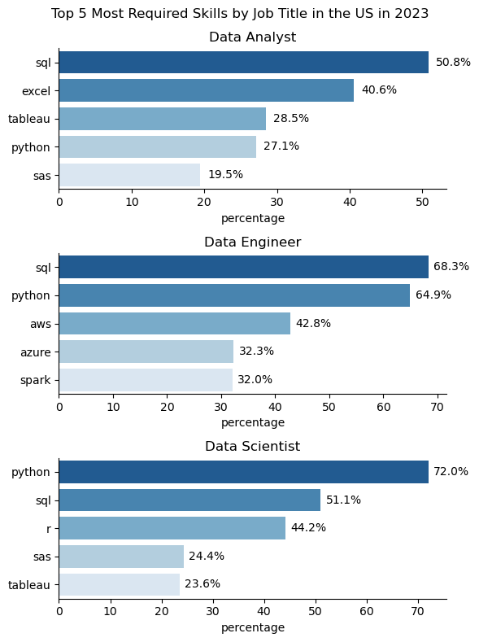

# Exploratory Data Analysis
## Top demanding skill by top 3 job title
View my notebook with detailed steps here: 
[Project.ipynb](project_youtube\project.ipynb)
### Visualize data
```python
plt.figure(figsize=(6, 8))

# Data Analyst
plt.subplot(3, 1, 1)
sns.barplot(data = DA_skill, x = 'percentage', y= 'job_skills', hue='job_skills', palette='Blues_r', legend = False)
sns.despine()
plt.title('Data Analyst')
plt.ylabel('')
for index, value in enumerate(DA_skill['percentage']):
    plt.text(value+1, index, f'{value:.1f}%', va='center')

# Data Engineer
plt.subplot(3, 1, 2)
sns.barplot(data = DE_skill, x = 'percentage', y= 'job_skills', hue='job_skills', palette='Blues_r', legend = False)
sns.despine()
plt.title('Data Engineer')
plt.ylabel('')
for index, value in enumerate(DE_skill['percentage']):
    plt.text(value+1, index, f'{value:.1f}%', va='center')

# Data Scientist
plt.subplot(3, 1, 3)
sns.barplot(data = DS_skill, x = 'percentage', y= 'job_skills', hue='job_skills', palette='Blues_r', legend = False)
sns.despine()
plt.title('Data Scientist')
plt.ylabel('')
for index, value in enumerate(DS_skill['percentage']):
    plt.text(value+1, index, f'{value:.1f}%', va='center')
plt.suptitle('Top 5 Most Required Skills by Job Title in the US in 2023')

plt.tight_layout()
plt.show()
```
### Result

### Insights
✅ Data Analysts focus on SQL, Excel, and visualization tools, making them specialists in business reporting and dashboarding.

✅ Data Engineers require SQL, Python, and cloud computing expertise (AWS, Azure, Spark), aligning with backend data 
pipeline management.

✅ Data Scientists demand Python, R, and SQL, with a clear emphasis on machine learning, statistics, and modeling.
### Conclusion
- While all three roles require SQL and Python, Data Engineers need cloud platforms (AWS, Azure, Spark), Data Scientists specialize in statistical tools (R, SAS), and Data Analysts emphasize Excel and Tableau.
- This visualization suggests that learning SQL and Python is essential across all roles, but additional skills depend on whether one is focused on business analytics (Analyst), infrastructure (Engineer), or machine learning (Scientist).