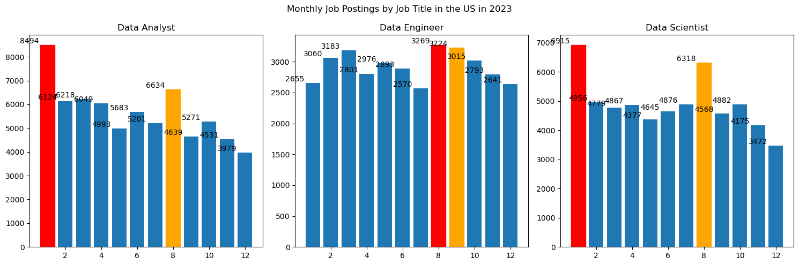
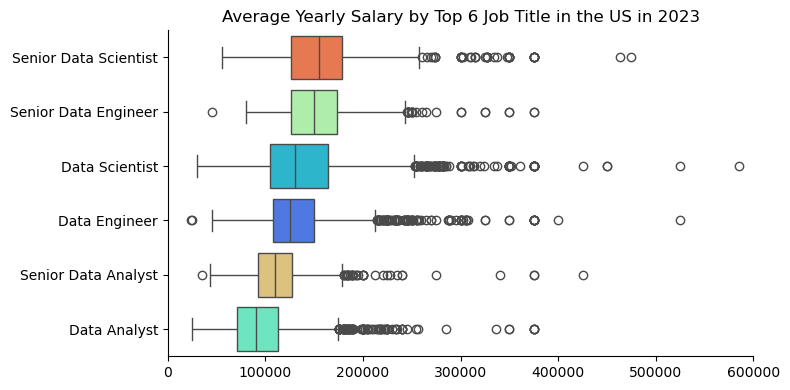
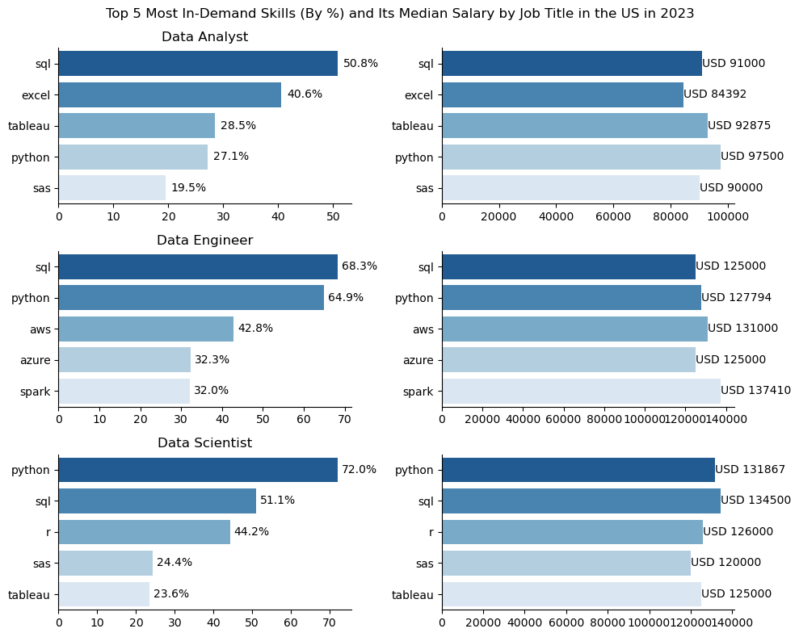
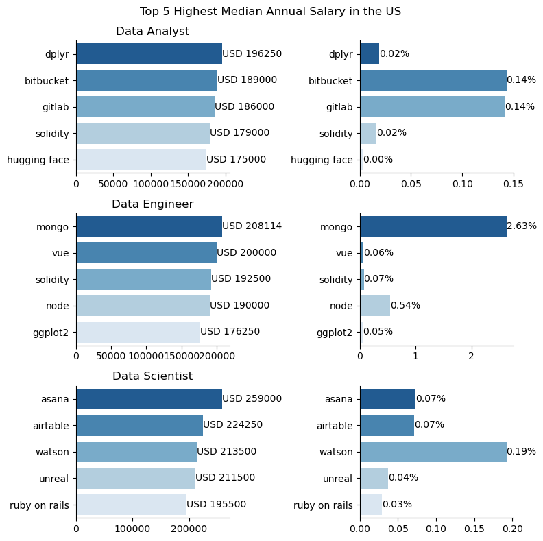
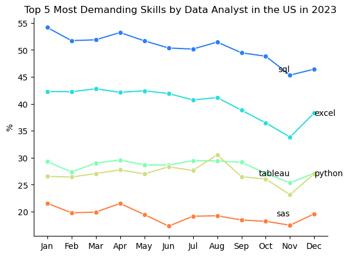
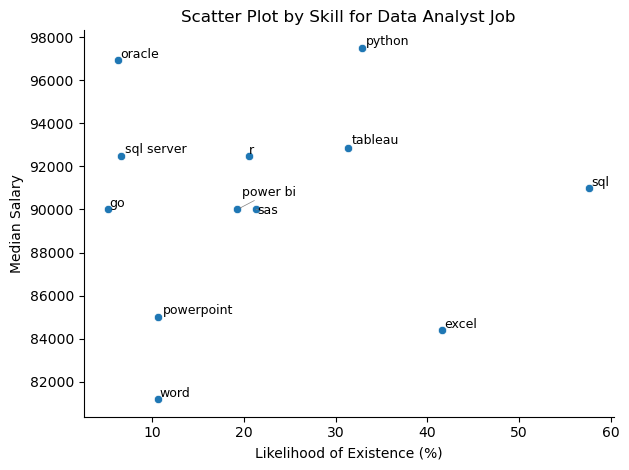

# Introduction
A dataset contains data about job market in Data Science field. This project focuses on top demanding skills, popular recruiting jobs, and top-paying skills and jobs; especially in the US's market. This helps audience to have a clear picture about job market in Data Science through author's visualization and insights.  
This is my first python project, data source is from Luke Barousse's Python Course which provides the foundation for my data analysis skill.
# Define the Problem or Research Question
- What is the overall picture of job market in the US within a year?
- What are the annual salary of top 3 job titles?
- What skills do employers require and pay the most in top 3 job titles?
- What optimal skills people, who want to land a job as a Data Analyst, should learn?
# Exploratory Data Analysis
## 1. Monthly Job Postings in the US
View my notebook with detailed steps here: 
[Project.ipynb](project_youtube\project.ipynb)
### Visualize data
```python
import matplotlib.pyplot as plt

# Assuming df1 is already defined and contains the necessary data

df_DA = df1.loc[df1['job_title_short'] == 'Data Analyst']
df_DE = df1.loc[df1['job_title_short'] == 'Data Engineer']
df_DS = df1.loc[df1['job_title_short'] == 'Data Scientist']

plt.figure(figsize=(15, 5))

# Data Analyst plot
plt.subplot(1, 3, 1)
df_DA_graph = df_DA['job_posted_month'].value_counts().sort_index(ascending=True)
bars = plt.bar(df_DA_graph.index, df_DA_graph.values)
# Highlight the most and second highest bars
highest = df_DA_graph.nlargest(2)
bars[df_DA_graph.index.get_loc(highest.index[0])].set_color('red')
bars[df_DA_graph.index.get_loc(highest.index[1])].set_color('orange')
for index, value in enumerate(df_DA_graph.values):
    plt.text(index, value, f'{value}', ha='center', va='bottom')
plt.title('Data Analyst')

# Data Engineer plot
plt.subplot(1, 3, 2)
df_DE_graph = df_DE['job_posted_month'].value_counts().sort_index(ascending=True)
bars = plt.bar(df_DE_graph.index, df_DE_graph.values)
# Highlight the most and second highest bars
highest = df_DE_graph.nlargest(2)
bars[df_DE_graph.index.get_loc(highest.index[0])].set_color('red')
bars[df_DE_graph.index.get_loc(highest.index[1])].set_color('orange')
for index, value in enumerate(df_DE_graph.values):
    plt.text(index, value, f'{value}', ha='center', va='bottom')
plt.title('Data Engineer')

# Data Scientist plot
plt.subplot(1, 3, 3)
df_DS_graph = df_DS['job_posted_month'].value_counts().sort_index(ascending=True)
bars = plt.bar(df_DS_graph.index, df_DS_graph.values)
# Highlight the most and second highest bars
highest = df_DS_graph.nlargest(2)
bars[df_DS_graph.index.get_loc(highest.index[0])].set_color('red')
bars[df_DS_graph.index.get_loc(highest.index[1])].set_color('orange')
for index, value in enumerate(df_DS_graph.values):
    plt.text(index, value, f'{value}', ha='center', va='bottom')
plt.title('Data Scientist')

plt.suptitle('Monthly Job Postings by Job Title in the US in 2023')
plt.tight_layout()
plt.show()
```
### Result

### Overview
1. Data Analyst positions had the highest number of job postings overall, peaking at 8,494 in January.
2. Data Scientist roles followed, with a peak of 7,015 in January.
3. Data Engineer roles consistently had the lowest postings among the three, peaking at 3,269 in August.
### Insights
1. Data Analyst and Data Scientist have same trend of job postings over years which have the most job postings in Jan, then stabilze in next months until the substantial increase in job postings in August and decrease in these following months. Meanwhile, the job postings in Data Engineer job remain stable with little fluctuation in months

2. Many companies have opened new positions in 3 Job Titles at the beginning of the year. Companies may also want fresh talent onboarded for new projects.  

3. The increase in job postings in August could be the hiring preparation in new projects for Q4 and the year ended. 

4. A hiring trend in Q4 are slowing down because companies pause hiring, especially in December, this could be budget constraints and decrease in new upcoming projects.
## 2. Annual salary by Job Title in the US
View my notebook with detailed steps here: 
[Project.ipynb](project_youtube\project.ipynb)
```python
top6 = df1['job_title_short'].value_counts().nlargest(6).index
df_top6 = df1.loc[df1['job_title_short'].isin(top6)]

df_top6.dropna(subset=['salary_year_avg'], inplace=True)

top6_order = df_top6.groupby('job_title_short')['salary_year_avg'].median().sort_values(ascending=False).index

plt.figure(figsize = (8,4))
sns.boxplot(data= df_top6, x='salary_year_avg', y='job_title_short', hue = 'job_title_short', order=top6_order, palette='rainbow')
sns.despine()
plt.xlim(0,600000)
plt.xlabel('')
plt.ylabel('')
plt.title('Average Yearly Salary by Top 6 Job Title in the US in 2023')
plt.tight_layout()
plt.show()
```
### Result

### Insights
1. The annual salary growth from Data Analyst to Senior Data Analyst is moderate, but the jump from Data Engineer to Senior Data Engineer or from Data Engineer to Senior Data Engineer are much larger.
2. The presence of outliers (some reaching $400,000 - $500,000 or more) indicates that certain professionals in data roles, likely working in top tech firms or finance, can earn exceptionally high salaries.
## 3. Top Demanding Skill in the US
View my notebook with detailed steps here: 
[Project.ipynb](project_youtube\project.ipynb)
### Visualize data
```python
plt.figure(figsize=(10, 8))
# Data Analyst

plt.subplot(3, 2, 1)
sns.barplot(data = DA_skill, x = 'percentage', y= 'job_skills', hue='job_skills', palette='Blues_r', legend = False)
sns.despine()
plt.title('Data Analyst')
plt.xlabel('')
plt.ylabel('')
for index, value in enumerate(DA_skill['percentage']):
    plt.text(value+1, index, f'{value:.1f}%', va='center')

plt.subplot(3, 2, 2)
sns.barplot(data=df_topskill_DA, x='Data Analyst', y='job_skills', hue = 'job_skills', palette='Blues_r')
sns.despine()
plt.xlabel('')
plt.ylabel('')
for index, value in enumerate(df_topskill_DA['Data Analyst']):
    plt.text(value, index, f'USD {value:.0f}', va='center')

# Data Engineer
plt.subplot(3, 2, 3)
sns.barplot(data = DE_skill, x = 'percentage', y= 'job_skills', hue='job_skills', palette='Blues_r', legend = False)
sns.despine()
plt.title('Data Engineer')
plt.xlabel('')
plt.ylabel('')
for index, value in enumerate(DE_skill['percentage']):
    plt.text(value+1, index, f'{value:.1f}%', va='center')

plt.subplot(3, 2, 4)
sns.barplot(data=df_topskill_DE, x='Data Engineer', y='job_skills', hue = 'job_skills', palette='Blues_r')
sns.despine()
plt.xlabel('')
plt.ylabel('')
for index, value in enumerate(df_topskill_DE['Data Engineer']):
    plt.text(value, index, f'USD {value:.0f}', va='center')

# Data Scientist

plt.subplot(3, 2, 5)
sns.barplot(data = DS_skill, x = 'percentage', y= 'job_skills', hue='job_skills', palette='Blues_r', legend = False)
sns.despine()
plt.title('Data Scientist')
plt.xlabel('')
plt.ylabel('')
for index, value in enumerate(DS_skill['percentage']):
    plt.text(value+1, index, f'{value:.1f}%', va='center')

plt.subplot(3, 2, 6)
sns.barplot(data=df_topskill_DS, x='Data Scientist', y='job_skills', hue = 'job_skills', palette='Blues_r')
sns.despine()
plt.xlabel('')
plt.ylabel('')
for index, value in enumerate(df_topskill_DS['Data Scientist']):
    plt.text(value, index, f'USD {value:.0f}', va='center')

plt.suptitle('Top 5 Most In-Demand Skills (By %) and Its Median Salary by Job Title in the US in 2023')

plt.tight_layout()
plt.show()
```
### Result

### Overview
1. Data Analysts focus on SQL, Excel, and visualization tools, making them specialists in business reporting and dashboarding.

2. Data Engineers require SQL, Python, and cloud computing expertise (AWS, Azure, Spark), aligning with backend data 
pipeline management.

3. Data Scientists demand Python, R, and SQL, with a clear emphasis on machine learning, statistics, and modeling.

### Insights
1. SQL is the most demanding skills required by recruiters in the US. SQL not only has the high likelihood of existance in Requirement part in Job Description, but it also have the moderate annual salary for Data Analysts.

2. As a Data Analyst job seekers, they should focus on being proficient in Database platforms (SQL, Excel). They also need to have knowledge on business intelligence tools such as Tableau, SAS  

3. Python is needed for both Data Scientists and Data Engineers. However, for Data Analysts, Python is less emphasized. It means  that while it can be a useful skill, it is not as critical as SQL or Excel.

4. The annual salary paid for skills in each job title are not varied. However, overall, the annual salary paid for skills of Data Analysts are relatively lower than those of Data Scientists or Data Engineers due to the emphasis on technical skills such as programming skills (Python, R), machine learning,.. 
### Conclusion
- While all three roles require SQL and Python, Data Engineers need cloud platforms (AWS, Azure, Spark), Data Scientists specialize in statistical tools (R, SAS), and Data Analysts emphasize Excel and Tableau.
- This visualization suggests that learning SQL and Python is essential across all roles, but additional skills depend on whether one is focused on business analytics (Analyst), infrastructure (Engineer), or machine learning (Scientist).
### Further Analysis
1. If I have enough data about specific industries posted that job, I could conclude that which industries pay the most and their required skills.  

## 4. Top Highest-paid Skills by Top 3 Job Titles in the US
View my notebook with detailed steps here: 
[Project.ipynb](project_youtube\project.ipynb)
```python
plt.figure(figsize=(8,8))
plt.subplot(3,2,1)
sns.barplot(data=df_skill_paid_DA, y='job_skills', x='Data Analyst',hue = 'job_skills', palette = 'Blues_r')
sns.despine()
for index,value in enumerate(df_skill_paid_DA['Data Analyst']):
    plt.text(value,index, f'USD {value:.0f}',va='center')
plt.xlabel('')
plt.ylabel('')
plt.title('Data Analyst')

plt.subplot(3,2,2)
sns.barplot(data=count_DA, x='percentage', y='job_skills', hue='job_skills', palette='Blues_r', legend=False)
sns.despine()
for index,value in enumerate(count_DA['percentage']):
    plt.text(value,index, f'{value:.2f}%',va='center')
plt.xlabel('')
plt.ylabel('')

plt.subplot(3,2,3)
sns.barplot(data=df_skill_paid_DE, y='job_skills', x='Data Engineer',hue = 'job_skills', palette = 'Blues_r')
sns.despine()
for index,value in enumerate(df_skill_paid_DE['Data Engineer']):
    plt.text(value,index, f'USD {value:.0f}',va='center')
plt.xlabel('')
plt.ylabel('')
plt.title('Data Engineer')

plt.subplot(3,2,4)
sns.barplot(data=count_DE, x='percentage', y='job_skills', hue='job_skills', palette='Blues_r', legend=False)
sns.despine()
for index,value in enumerate(count_DE['percentage']):
    plt.text(value,index, f'{value:.2f}%',va='center')
plt.xlabel('')
plt.ylabel('')

plt.subplot(3,2,5)
sns.barplot(data=df_skill_paid_DS, y='job_skills', x='Data Scientist',hue = 'job_skills', palette = 'Blues_r')
sns.despine()
for index,value in enumerate(df_skill_paid_DS['Data Scientist']):
    plt.text(value,index, f'USD {value:.0f}',va='center')
plt.xlabel('')
plt.ylabel('')
plt.title('Data Scientist')

plt.subplot(3,2,6)
sns.barplot(data=count_DS, x='percentage', y='job_skills', hue='job_skills', palette='Blues_r', legend=False)
sns.despine()
for index,value in enumerate(count_DS['percentage']):
    plt.text(value,index, f'{value:.2f}%',va='center')
plt.xlabel('')
plt.ylabel('')

plt.suptitle('Top 5 Highest Median Annual Salary in the US')
plt.tight_layout()
plt.show()
```
### Result

### Insight
1. Some niche skills are required by employers such as dplyr, bitbucket, mongo... These skills, which are required by employers, are uncommon but highly compensated. However, they appear in job postings less frequently. Job opportunities may be limited, attracting few job seekers even though these skills are well-paid.

## 5. Skill Trend Demand of Data Analysts in the US
View my notebook with detailed steps here: 
[Project.ipynb](project_youtube\project.ipynb)
```python
sns.lineplot(data = df_DA_pivot, legend = False, dashes = False, marker = 'o', palette = 'rainbow')
sns.despine()
plt.xlabel('')
plt.ylabel('%')
plt.title('Top 5 Most Demanding Skills by Data Analyst in the US in 2023')
# Annotate each line at the last data point
used_positions = set()

used_positions = set()
alignment = ['left', 'right']  # Alternating alignment

used_positions = set()

for i, column in enumerate(df_DA_pivot.columns):
    last_value = df_DA_pivot[column].iloc[-1]  # Last y-value
    last_x = df_DA_pivot.index[-1]  # Last x-value (month)

    # Adjust position if label would overlap
    offset = 0
    while (last_value + offset) in used_positions:
        offset += 0.8  # Shift up slightly

    used_positions.add(last_value + offset)

    # Alternate between placing the label at the end of November and December
    if i % 2 == 0:
        plt.text(df_DA_pivot.index[-2], last_value + offset, column, fontsize=10, verticalalignment='center', horizontalalignment='right')
    else:
        plt.text(last_x, last_value + offset, column, fontsize=10, verticalalignment='center', horizontalalignment='left')
plt.show()
```
### Result

### Insights
1. SQL and Excel are two of the most demanding skills required by employers for Data Analyst job through 12 months. As a Data Analyst job seekers, they should prioritize on learning and enhancing their proficiency in these 2 skills.
2. The decline in all required skills in November results from the decrease in number of job postings, not due to the reduction in its demand (shown on Heading 1)
3. Python (programming skill) and Tableau (visualization tool) remains valuable skills for Data Analysts and are relatively high-demanded by recruiters. 
## 6. The Optimal Skills To Learn As Data Analysts
Lastly, I will find out which skills are optimal to learn for a Data Analyst to land a job in the US. An optimal skill is defined as a skill which has both high demand and high annual compensation by employers.  

View my notebook with detailed steps here: 
[Project.ipynb](project_youtube\project.ipynb)
```python
from adjustText import adjust_text
sns.scatterplot(data = df_DA_groupby, x='percentage', y='median',legend=True)
sns.despine()
# Add labels to each point
texts = []
for i, row in df_DA_groupby.iterrows():
    texts.append(plt.text(row['percentage'], row['median'], row['job_skills'], fontsize=9))

# Adjust text positions to avoid overlap
adjust_text(texts, arrowprops=dict(arrowstyle='->', color='gray', lw=0.5))
plt.xlabel('Likelihood of Existence (%)')
plt.ylabel('Median Salary')
plt.title('Scatter Plot by Skill for Data Analyst Job')
plt.tight_layout()
plt.show()
```
### Result

### Insights
1. SQL is by far the most common skill (~58% job postings), making it a obliged requirement for Data Analysts.
Despite its high demand, the salary is not the highest, just moderately, indicating that it is a fundamental skill rather than a niche expertise.
2. Meanwhile, Python is the highest paying skill among popular skills. While not as common as SQL, Python’s high salary shows its importance in automation, machine learning, and advanced analytics for specific industries such as technology, finance.
3. Skills related to Microsoft Office (PowerPoint, Word) are common and necessary for reporting and presentations, though these tools do not drive salary growth. Except for Excel, this remains an highly essential tool for Data Analysis. Excel has high job presence but relatively lower pay
# What I learned
Through this project, I have learned the basis of Python for my project. It includes data preprocessing, data cleaning, data manupulation and finally data analysis.

1. Data Manipulation
- I could handle large datasets, clean missing values (especially salary_year_avg column), filter relavant information as my expectation by using Pandas. 
- I improved skills in grouping, aggregating, and transforming data to extract meaningful trends. 
- I could understand how to change datetime datatype by using pd.to_datetime() and its necessity to alter correct datatype.
- I used apply() and explode() function to convert a string into a list and then explode all a the list into each rows for better analysis of job skills
2. Data Visualization (Matplotlib, Seaborn)
- I understood how to use suitable graphs for suitable data
- Use matplotlib library (plt.text, plt.xtick, plt.xlim, pltsuptitle...) and seaborn library (sns.despine) simultaneously for particular tasks
- I improved layout by using Matplotlib’s subplots() to create multiple charts in one figure for better comparison
3. ChatGPT & Copilot Chats 
- In favor of generative AI, it helps me to fix my errors and add some features on the graphs.
4. Git and GitHub
- I understood what Git and GitHub and how to use Git to track changes for my local repository and share on public Github remotely
# Conclusion
This project provided valuable insights into the job market for Data Analysts, Data Engineers, and Data Scientists, along with a deep dive into salary trends, skill demand, and career growth opportunities. Additionally, it strengthened Python-based data analysis and visualization skills. 

This project is my essential foundation for further analysis and marks my serious learning in data field; especially the interference of data and finance.

I would like to acknowledge with my most sincere thanks for your reading.